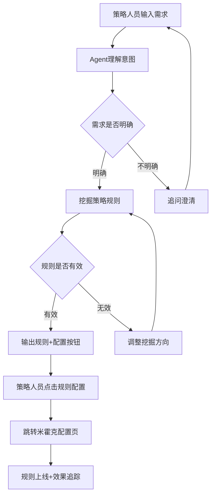
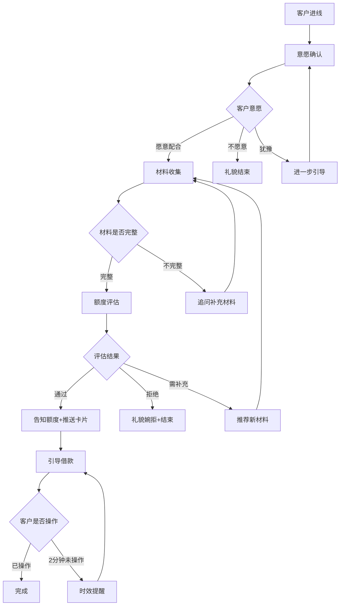
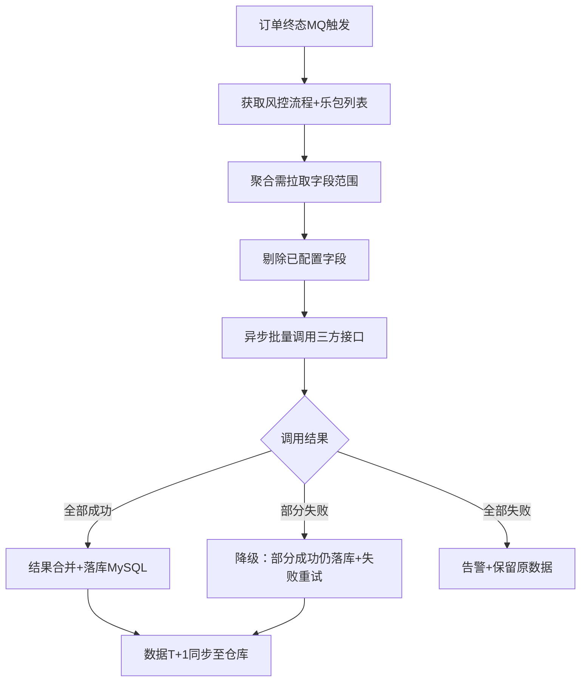

# 风控智能体话术模式

> 本文件列出风控Agent/智能体项目的常见对话模式，供生成PRD话术设计时参考。
> 基于「清退策略Agent」和「IM交易回捞智能体」两个真实项目提炼。

---

## 模式分类

### 一、策略挖掘模式（清退Agent类）

**适用场景**：策略人员通过自然语言描述需求，Agent自动挖掘规则并输出配置建议。

#### 对话流程

#### 关键话术节点

| 节点 | 话术模板 | 说明 |
|---|---|---|
| 需求确认 | "我理解您想要挖掘[场景]的清退策略。请确认：1.样本数据来自[XX表]？2.Y标是[XX指标]？3.观察指标包括[XX]？4.GMV损失控制X%？" | 确认关键参数后再开始挖掘 |
| 规则输出 | "根据您的需求，我挖掘到以下规则：[规则列表]。每条规则已打上唯一标记[ID]，您可以通过【规则配置】按钮将规则部署到米霍克决策引擎。" | 规则+唯一标记+配置入口 |
| 效果反馈 | "规则[标记ID]上线后的效果数据：命中率XX%，误杀率XX%，GMV影响XX%。" | 效果追踪数据 |
| 迭代建议 | "基于效果数据，我建议：[迭代方向]。是否需要我继续挖掘？" | 主动提供迭代建议 |

---

### 二、回捞沟通模式（IM回捞类）

**适用场景**：机器人与客户通过IM对话，完成意愿确认、材料收集、限额评估、引导借款。

#### 对话流程

#### 关键话术节点

| 节点 | 话术模板 | 说明 |
|---|---|---|
| 意愿确认-同意 | "太好了！为了帮您尽快完成审核，我们需要您提供一些补充材料。请问您方便提供以下材料吗？[材料清单]" | 引导进入材料收集 |
| 意愿确认-拒绝 | "没问题，如果您后续有需要可以随时联系我们。本次服务结束，祝您生活愉快！" | 礼貌结束 |
| 意愿确认-犹豫 | "补充材料可以帮助您获得更高的额度哦！只需要[操作]，大约[X分钟]就能完成。您愿意试试吗？" | 说明好处+降低门槛 |
| 材料推送 | "请您提供以下材料：1.[材料1] 2.[材料2] 3.[材料3]。您可以直接拍照或截图发给我。" | 清晰列举+操作指引 |
| 材料确认 | "已收到您的[材料名称]，正在为您处理。请问还有其他材料需要提交吗？" | 确认收到+引导继续 |
| 评估通过 | "恭喜！评估完成！根据您提交的材料，为您特批专属额度为：XXX元。" | 告知额度 |
| 评估拒绝 | "很抱歉，经过综合评估，本次暂时无法为您提供服务。建议您保持良好的信用记录，XX天后可再次尝试。" | 礼貌婉拒+不透露原因 |
| 评估需补充 | "您的信用证明材料还可以更充分一些。建议补充：[新材料列表]。您有哪个可以补充？" | 推荐补充方向 |
| 推送卡片 | "借款额度已准备就绪！请点击下方卡片立即借款，最快X分钟到账～" | 引导操作 |
| 时效提醒 | "您有XXX元专属借款额度待使用！卡片将在XXX分钟后过期，请立即点击卡片完成借款。" | 时效紧迫感 |

---

### 三、数据回溯模式（特征回溯类）

**适用场景**：无对话交互，纯数据旁路计算。但需要说明数据流程和异常处理。

#### 数据流程

#### 此模式无对话话术，但需要说明

- MQ触发条件和消息格式
- 降级策略（部分成功/全部失败的处理）
- 数据时效性标注（T+1/实时/需实时版本）
- 数据完整性校验方式

---

## 话术设计注意事项

### 1. 每条话术必须可独立使用
- 不依赖上下文对话历史
- 新用户看到此话术也能理解含义

### 2. 话术边界必须清晰
- 不同场景的话术不能混淆
- 同一场景只有一种标准话术

### 3. 话术必须包含下一步引导
- 每条话术末尾引导用户进入明确的下一步
- 不能出现"不知道接下来做什么"的情况

### 4. 话术必须有兜底结束流程
- 每个对话分支都有明确的结束条件
- 不能无限循环对话

### 5. 拒绝类话术的合规要求
- **绝不透露具体拒绝原因**（这是风控合规底线）
- 使用"综合评估"等模糊表述
- 提供改进建议但不说明具体不足