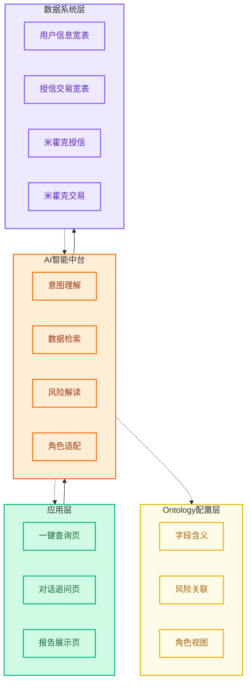
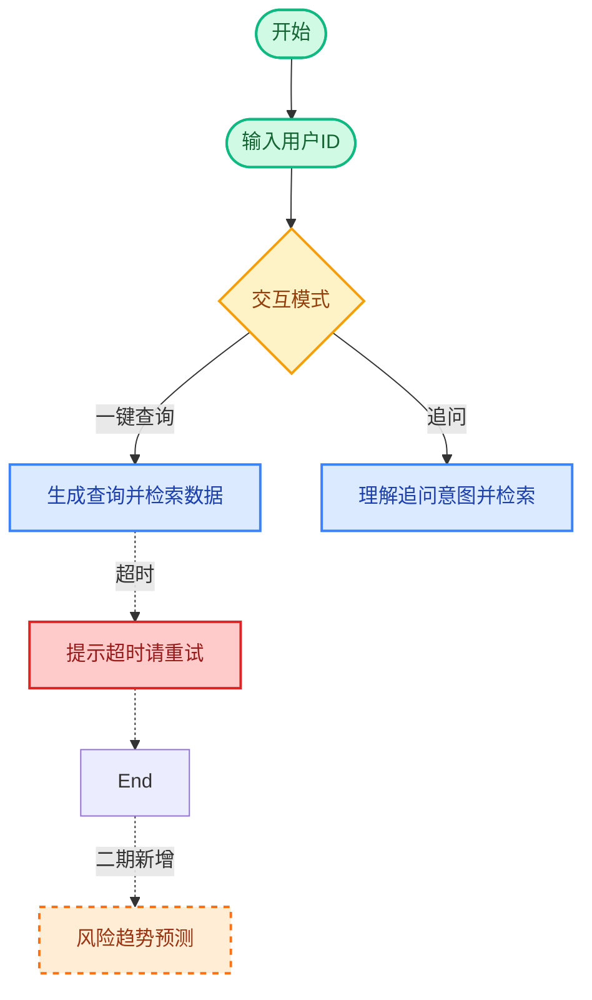
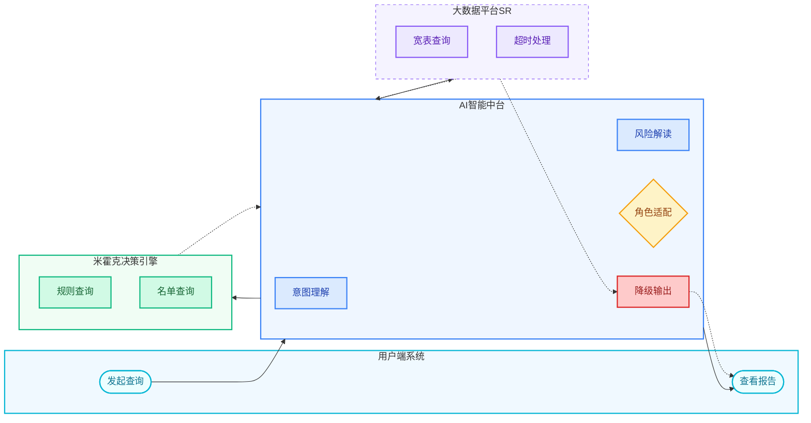

# Mermaid 简版制图规范（PRD 正文内嵌版）

> 定位：轻量化、代码化、文档内嵌、去掉冗余细节、控制连线数量
> 适用场景：写 PRD 时直接嵌 markdown、快速评审、需求初稿

---

## 1. 架构图 Mermaid 细则

### 1.1 语法模板



### 1.2 强制规则

| # | 规则 | 说明 |
|---|------|------|
| 1 | **只画汇总线** | 大模块间只画 1 根汇总连线，禁止子节点全量细线 |
| 2 | **内部子模块无线** | 宽表/配置字段只罗列名称，不画内部连线 |
| 3 | **红色=异常降级** | 降级输出节点用 `classDef fallback`，代码内加 `%% 图例：红色=异常降级` |
| 4 | **注释标注图例** | 顶部用 `%%` 注释标注配色含义和虚实线定义 |

---

## 2. 业务流程图 Mermaid 细则

### 2.1 语法模板



### 2.2 强制规则

| # | 规则 | 说明 |
|---|------|------|
| 1 | **标准符号** | `([开始])` 圆角=起止，`[步骤]` 矩形=处理，`{判断}` 菱形=分支 |
| 2 | **主干实线** | 正常流程用实线 `-->` |
| 3 | **异常虚线** | 超时/失败/降级用虚线 `-.->` |
| 4 | **菱形分支标注** | 连线必须标注 `--|"分支文案"|>` |
| 5 | **精简折返线** | 避免多余折返，主干从上到下 |
| 6 | **注释标注图例** | `%% 虚线框=二期迭代内容` |

---

## 3. 泳道图 Mermaid 细则

### 3.1 语法模板



### 3.2 强制规则

| # | 规则 | 说明 |
|---|------|------|
| 1 | **顶层 LR** | `flowchart LR` 横向排布泳道列 |
| 2 | **列内 TB** | 每个 `subgraph` 内部 `direction TB` 纵向走流程 |
| 3 | **粗粒度汇总线** | 跨系统只画 1 根汇总线，明细调用不进主泳道图 |
| 4 | **实线=调用** | 主动同步调用（左→右，上→下） |
| 5 | **虚线=回传** | 数据回传（右→左，下→上） |
| 6 | **无箭头文字** | 箭头上不写描述，描述放进节点框内 |
| 7 | **4列标准口径** | 用户端 / AI中台 / 大数据 / 决策引擎 |

---

## 4. 图例注释标准

```
%% 图例注释（必须放在代码顶部）
%% 配色：浅绿=应用层，浅橙=AI中台，米黄=配置层，浅紫=数据层，红色=异常降级
%% 实线=上层主动调用，虚线=下层数据回传
%% 圆角矩形=开始/结束，直角矩形=处理步骤，菱形=判断分支
```

---

*规范版本：v1.0 | 创建日期：2026/06/05*