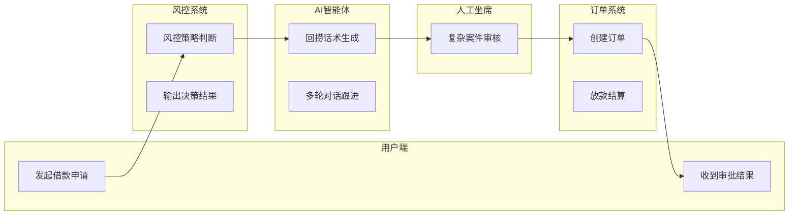

> ⚠️ **已废弃** — 请使用 `diagram-spec-v2.md`（通用顶层规范）。v1.0 仅保留供历史参考。

# PRD 全套附图规范手册 v1.0 [已废弃]

> 定义 PRD 文档中必须包含的 4 大类图纸标准：产品架构图、业务流程图、BPMN 泳道流程图、产品原型图。
> 附带图例标准、适用场景、PRD 章节安放、画法规范、易错禁忌和自检清单。
> 适配信贷 AI 回捞产品场景，通用部分适用于所有 PRD 项目。

---

## 总目录：一份标准 PRD 必须包含 4 类图纸（按撰写先后顺序）

| 序号 | 图纸类型 | 撰写阶段 | 核心作用 | Mermaid 语法 | drawio 交付 |
|------|---------|---------|---------|-------------|------------|
| ① | **产品架构图** | 开篇：产品整体结构 | 全局产品大盘、模块域划分、分层依赖 | `flowchart TB` + `subgraph` | 必须 |
| ② | **业务流程图** | 业务规则：单个业务流转 | 一件业务从开始到结束全走向 | `flowchart TD` | 必须 |
| ③ | **BPMN 泳道流程图** | 落地对接：跨角色/跨系统 | 明确谁在什么节点做什么、跨系统交互 | `flowchart LR` + `subgraph`（竖泳道） | 必须 |
| ④ | **产品原型图** | 页面需求：前端交互 | 页面布局、按钮、交互跳转 | Axure/墨刀原型 | 截图嵌入 |

可选补充（信贷 / AI 产品强烈建议加）：

| 序号 | 图纸类型 | 核心作用 | PRD 位置 |
|------|---------|---------|---------|
| ⑤ | **数据结构图（ER 简图）** | 核心数据表字段关联 | 附录 - 数据设计 |
| ⑥ | **简易接口清单图** | 接口名称、出入参 | 接口对接章节 |

---

## 一、产品架构图

### 1.1 图纸定义

用来梳理产品自上而下分层、模块域划分、系统依赖关系，从用户应用→中台能力→底层数据，全局产品大盘。

分「业务汇报版」和「技术落地版」2 种格式。

### 1.2 标准分层规范（强制自上而下顺序，不可颠倒）

| 分层 | 通用配色 | 内容定义（适配信贷 AI 回捞项目） |
|------|---------|-------------------------------|
| **应用层（用户交互层）** | 浅绿 `#d1fae5` / 边框 `#10b981` | 用户可见功能：借款申请入口、智能问答、回捞对话、申请/加购等前端功能 |
| **能力中台层** | 浅黄 `#fef3c7` / 边框 `#f59e0b` | AI 语义能力、风控决策、召回匹配、话术生成等 AI / 业务能力 |
| **数据 & 交易底层** | 浅紫 `#ede9fe` / 边框 `#8b5cf6` | 用户库、风控 SKU 库、订单系统、放款结算系统、底层数据源 |

> 大型系统可扩展 5 层：渠道接入→应用层→中台层→数据层→基础设施层；
> 小型产品固定 3 层即可。

### 1.3 两种版本绘制标准

#### ① 业务汇报版（无连线，PRD §1 产品概述使用）

- 左侧竖向标注层级名称：XX 层
- 同层级按业务域分组，同业务模块放入同一大框
- **禁止画箭头连线**，只做区块划分
- 模块命名统一为「业务模块名」，名词短语

#### ② 技术落地版（带依赖连线，PRD 附录 - 系统设计使用）

- 实线箭头：上层调用下层服务（自上而下）
- 虚线箭头：底层数据向上同步、结果回传（自下而上）
- **禁止跨层级越级连线**（应用不能直接连底层数据，必须经过中间能力层）

### 1.4 PRD 放置位置

| PRD 章节 | 放置版本 | 说明 |
|---------|---------|------|
| §1 产品概述 - 产品架构说明 | **汇报版架构图** | 给产品/业务方看全局大盘 |
| 附录 - 系统对接章节 | **带连线落地版架构图** | 给研发看依赖关系 |

### 1.5 画图禁忌

- ❌ 层级上下颠倒
- ❌ 同层级功能名 / 系统名混用
- ❌ 汇报版乱加连线
- ❌ 技术落地版跨层级越级连线

---

## 二、业务流程图

### 2.1 图纸定义

聚焦单一业务主线逻辑，只描述：步骤→判断→分支结果。

**不区分角色、不区分系统**，用来讲清楚「一件业务从开始到结束全走向」。

### 2.2 标准图例规范（国标通用流程图符号，强制统一）

| 图形 | 含义 | Mermaid 语法 | drawio 形状 | 使用规则 |
|------|------|-------------|------------|---------|
| 圆角矩形 / 圆形 | 开始 / 结束节点 | `A(([开始]))` | `rounded=1;ellipse` | 全流程首尾专用 |
| 直角矩形 | 业务操作步骤 | `B[步骤名]` | `rounded=0;rectangle` | 用户操作 / 系统处理动作 |
| 菱形 | 判断分支节点 | `C{判断条件}` | `rhombus` | 是/否、通过/拒绝、多分支选择（如风控通过/拒绝/限额度） |
| 直线箭头 | 流转方向 | `A --> B` | `orthogonalEdgeStyle` | 箭头指向流程下一节点，禁止无箭头连线 |
| 彩色填充框 | 版本区分 | `style` 自定义 | `fillColor` | 橙色 = 二期新增需求、浅色 = 存量需求 |

### 2.3 绘制规范

1. **流程自上而下顺序排布**，主干在中间，分支向左右展开
2. **一个流程图只画一个主业务**（例：借款申请→风控→回捞全链路一张图；人工审核单独一张子流程图）
3. **分支标注清晰**：每个菱形出口写明分支文案（通过 / 拒绝 / 限额度 / 转人工）
4. **异常流程不能遗漏**：失败、超时、降级、回退等异常分支必须画出

### 2.4 PRD 放置位置

| PRD 章节 | 说明 |
|---------|------|
| §3 分模块需求 → 各模块业务规则小节 | 一个核心业务配一张业务流程图 |

典型子模块配图：

- 借款进件流程 → 风控审核模块
- 风控策略审核流程 → 风控审核模块
- 回捞智能体跟进流程 → AI 回捞智能体模块
- 人工审核放款流程 → 人工审核放款模块

### 2.5 画图禁忌

- ❌ 一张图塞多个无关业务
- ❌ 流程图内标注角色 / 系统（角色和系统分工由泳道图负责）
- ❌ 箭头乱飞无指向
- ❌ 只画主干流程忽略异常分支
- ❌ 节点命名使用抽象编号（Step1/NodeA 等）

---

## 三、BPMN 泳道流程图

### 3.1 图纸定义

跨角色 / 跨系统协作流程图：
- **纵向**：业务流程步骤（自上而下）
- **横向竖线分割**为【泳道】，每一列 = 一个角色 / 系统

明确：**谁在什么节点做什么、哪个系统处理、跨系统交互点**。

### 3.2 标准规范

| 规范项 | 要求 |
|-------|------|
| **横向泳道列定义** | 表头标注泳道名称（用户端 / 风控系统 / AI 智能体 / 人工坐席 / 订单系统） |
| **纵向步骤排布** | 业务步骤自上而下排布 |
| **步骤框位置** | 每个步骤框只能落在对应责任方的泳道内 |
| **跨泳道箭头** | 跨角色 / 跨系统接口调用（A 系统→B 系统需要对接接口） |
| **图例** | 沿用业务流程图统一符号（圆角起止、矩形动作、菱形判断） |

### 3.3 Mermaid 实现方式

泳道图使用 `flowchart LR` + `subgraph` 实现竖泳道：

> 注意：Mermaid 泳道图是中间态预览，最终交付物为 drawio XML 文件。
> drawio 中使用竖泳道容器（`swimlane` 形状），每列一个容器。

### 3.4 版本区分 & PRD 位置

| PRD 章节 | 说明 |
|---------|------|
| §4 对接方案 / 接口说明 | 研发、测试用来梳理接口清单、拆分各系统开发范围 |
| 附录（复杂大业务） | 主泳道图 + 子泳道图（主回捞全链路大图 + 人工审核子泳道图） |

### 3.5 画图禁忌

- ❌ 一个步骤跨两个泳道（步骤只能归属单一责任方）
- ❌ 不标注泳道名称
- ❌ 跨泳道不画箭头（跨系统调用必须画连线）
- ❌ 泳道内步骤无序排列（必须自上而下）

---

## 四、产品原型图

### 4.1 图纸定义

前端页面可视化图纸，对应架构图里【应用层】所有功能入口，展示页面布局、按钮、输入框、弹窗、交互跳转逻辑。

### 4.2 标准化规范

| 规范项 | 要求 | 示例 |
|-------|------|------|
| **页面编号规范** | `模块-页面编号` | 回捞模块 - H01 回捞对话首页 |
| **交互标注** | 按钮点击后跳转页面 / 弹出弹窗，备注在原型旁 | [点击「申请借款」→ 跳转 H02 借款申请页] |
| **字段说明** | 输入框、下拉选项、文案备注数据来源 | [风控评分 → 来自风控系统实时计算] |

### 4.3 PRD 放置位置

| PRD 章节 | 说明 |
|---------|------|
| §5 页面需求章节 | PRD 正文插入原型截图，完整源文件作为 PRD 附件 |

### 4.4 画图禁忌

- ❌ 页面无编号（必须标注模块-编号）
- ❌ 交互跳转无备注（每个按钮都要标注跳转目标）
- ❌ 数据字段无来源标注

---

## 五、可选补充图纸（信贷 / AI 产品强烈建议加）

### 5.1 数据结构图（ER 简图）

| 项目 | 内容 |
|------|------|
| 用途 | 对应架构图【数据层】，梳理核心数据表：用户表、风控表、订单放款表字段关联 |
| PRD 位置 | 附录 - 数据设计 |
| Mermaid 语法 | `erDiagram` |

### 5.2 简易接口清单图

| 项目 | 内容 |
|------|------|
| 用途 | 标注应用层→AI 能力层、AI→底层系统之间接口名称、出入参 |
| PRD 位置 | 接口对接章节 |
| 格式 | 接口定义表（接口名称 / 方向 / 请求方式 / 关键参数 / 返回值 / 调用时机） |

---

## 六、PRD 配图落地清单（直接套用目录）

| PRD 章节 | 必须附上图纸 | 图纸版本 |
|---------|-------------|---------|
| §1 产品概述 | 产品架构图 | 汇报版·3 层 |
| §2 全局业务说明 | 全链路借款审批业务流程图 | 主干+异常分支 |
| §3 模块需求 ①风控审核模块 | ①子模块业务流程图 + ②对应跨系统 BPMN 泳道图 | 各1张 |
| §3 模块需求 ②AI 回捞智能体模块 | ①子模块业务流程图 + ②对应跨系统 BPMN 泳道图 | 各1张 |
| §3 模块需求 ③人工审核放款模块 | ①子模块业务流程图 + ②对应跨系统 BPMN 泳道图 | 各1张 |
| §5 页面交互需求 | 全页面原型图 | Axure 截图 |
| §4 系统对接 & 接口 | 架构落地版（带连线） + 全链路 BPMN 泳道图 + 接口清单 | 落地版 |
| 附录 | 数据结构图 + 二期需求变更标注图 | ER + 版本标注 |

---

## 七、画图自检通用检查表（PM 出图前逐项核对）

### 架构图自检

| # | 检查项 | 标准 | 判定 |
|---|-------|------|------|
| 1 | 层级从上到下顺序正确 | 应用层→中台层→数据层 | ✅/❌ |
| 2 | 配色规范 | 浅绿/浅黄/浅紫对应三层 | ✅/❌ |
| 3 | 命名统一 | 同层级使用统一命名风格（业务模块名 / 系统名） | ✅/❌ |
| 4 | 汇报版无连线 | 业务汇报版禁止箭头连线 | ✅/❌ |
| 5 | 技术版无越级连线 | 应用层不能直接连底层数据 | ✅/❌ |

### 业务流程图自检

| # | 检查项 | 标准 | 判定 |
|---|-------|------|------|
| 1 | 符号统一 | 圆角起止、矩形步骤、菱形判断 | ✅/❌ |
| 2 | 分支文案齐全 | 每个菱形出口写明通过/拒绝/限额度等 | ✅/❌ |
| 3 | 不混入角色信息 | 业务流程图不标注角色/系统名 | ✅/❌ |
| 4 | 异常分支完整 | 至少包含1个异常/失败分支 | ✅/❌ |
| 5 | 一图一业务 | 不塞多个无关业务 | ✅/❌ |

### 泳道图自检

| # | 检查项 | 标准 | 判定 |
|---|-------|------|------|
| 1 | 泳道表头齐全 | 每列标注角色/系统名称 | ✅/❌ |
| 2 | 步骤不跨列 | 每个步骤只落在对应泳道内 | ✅/❌ |
| 3 | 跨系统调用箭头完整 | A→B跨泳道必须画连线 | ✅/❌ |
| 4 | 步骤纵向有序 | 泳道内步骤自上而下排布 | ✅/❌ |

### 原型图自检

| # | 检查项 | 标准 | 判定 |
|---|-------|------|------|
| 1 | 页面编号完整 | 模块-编号格式（如 H01） | ✅/❌ |
| 2 | 交互跳转备注清晰 | 每个按钮标注跳转目标 | ✅/❌ |
| 3 | 字段来源标注 | 数据字段备注来源系统 | ✅/❌ |

---

## 八、与现有规范体系的关系

本文件定义**图纸类型、PRD 安放和画法规范**，以下文件定义**渲染和生成机制**：

| 规范文件 | 职责 | 与本文件的关系 |
|---------|------|-------------|
| `standards/flowchart-standard.md` | HTML 渲染规范、drawio 连线规范 | 本文件定义「画什么图」和「放哪里」，该文件定义「怎么画得好看」 |
| `standards/flowchart-guidelines.md` | AI 生成 drawio 的布局/连线规则 | 本文件定义图纸类型后，AI 生成时遵循该文件的布局规范 |
| `standards/html-style-standard.md` | 阿里云简约风格 CSS | 架构图 HTML 渲染时使用该文件的风格 |
| `standards/html-editable-spec.md` | 可编辑 HTML 交互规格 | 所有附图的 HTML 版本遵循该文件的可编辑规则 |
| `knowledge/diagrams/color-schemes.json` | 配色方案库 | 本文件的配色定义写入该 JSON |

---

*规范版本：v1.0 | 创建日期：2026/06/04 | 适配信贷 AI 回捞产品，通用部分适用于所有 PRD 项目*