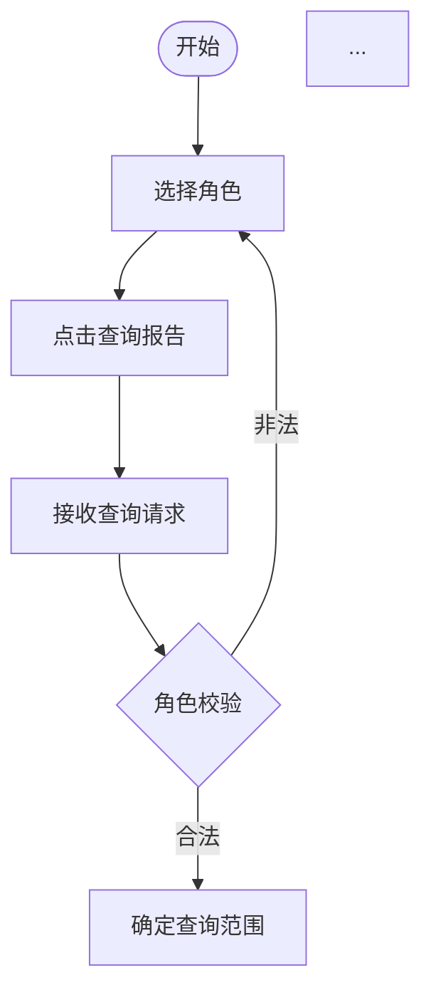
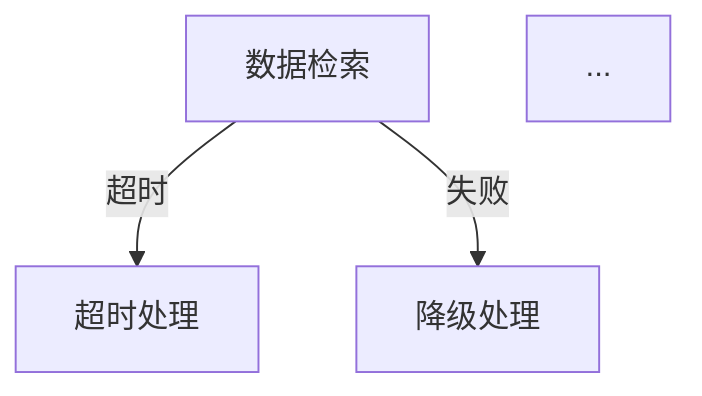
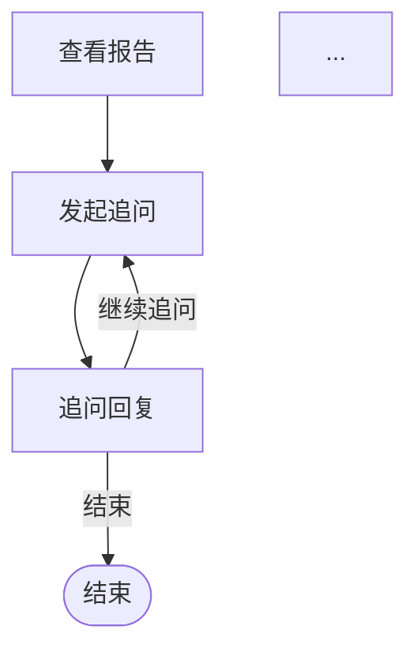

# 流程规划 Skill

## 定位

PRD 生成的前置步骤。输入用户需求（以需求卡为理解基线），输出**人审友好**的流程规划文档。

**核心价值**：在写PRD之前，先把流程彻底理清楚，减少开发返工。

**双视角设计**：
- **用户旅程视角**（Step 2）：从用户视角描述"进入→动作→反馈→结果"，关注用户体验闭环
- **业务流程视角**（Step 3-5）：从系统视角描述"用户端→前端→Agent→数据层"，关注参与方链路

**设计原则**：
- **人审优先**：flow-plan.md 是给人在 Obsidian 里审阅的，优先可读性（文字+Mermaid图）
- **机器数据后移**：节点/连线清单移到蓝图阶段（blueprint是drawio的结构化输入，清单在那里才有用）
- **Obsidian友好**：内嵌Mermaid代码块，Obsidian打开自动渲染，无需额外工具
- **双视角互补**：用户旅程验证"体验是否闭环"，业务流程验证"系统是否可行"

## 输出目录

```
output/[项目名]/
├── flow-planning/
│   ├── [项目名]-flow-plan.md      # 流程规划文档（双视角：用户旅程+业务流程，内嵌Mermaid图）
│   └── [项目名]-flow-review.html  # 流程review页面（可选，Step 9产出）
```

> 注：节点/连线清单不再在flow-plan.md中产出，而是移至蓝图阶段（blueprint/）。
> Mermaid流程图直接内嵌在flow-plan.md中，Obsidian打开自动渲染。

## 执行流程（9 步）

### Step 1: 业务场景梳理（文字）

输出：
```markdown
## 1. 业务场景

### 1.1 用户角色
- **角色A**：角色描述
- **角色B**：角色描述

### 1.2 使用场景
场景描述（用户怎么用、怎么触发）

### 1.3 核心目标
一句话概括
```

---

### Step 2: 用户旅程描述（NEW — 用户视角）

> 从用户视角描述完整的使用旅程。聚焦"用户看到什么、做什么、得到什么反馈"，而非系统内部实现。

```markdown
## 2. 用户旅程（用户视角）

> 描述用户从进入到完成的全过程，关注体验闭环。

### 2.1 旅程总览

| 阶段 | 用户动作 | 系统反馈 | 用户情绪 |
|------|---------|---------|---------|
| **进入** | [用户怎么进入产品？第一眼看到什么？] | [初始界面/状态] | [预期情绪] |
| **操作** | [用户做什么？关键步骤是什么？] | [每一步的系统反馈] | [预期情绪] |
| **完成** | [用户怎么知道任务完成了？] | [最终结果呈现] | [预期情绪] |

### 2.2 关键时刻

列出旅程中对用户体验影响最大的 2-3 个关键时刻：

1. **[关键时刻名称]**：[描述] — 为什么关键？
2. **[关键时刻名称]**：[描述] — 为什么关键？

### 2.3 体验检查

- [ ] 每个用户动作都有对应的系统反馈？
- [ ] 用户在任何时刻都知道"我现在在哪、下一步可以做什么"？
- [ ] 完成路径清晰，没有死胡同？
```

---

### Step 3: 主流程文字描述（系统视角）

按阶段描述流程，每个阶段标注参与方（用户端/前端/Agent/后端服务）：

```markdown
## 3. 主流程（系统视角 — 文字描述）

### 3.1 [阶段名称]

**用户端 → 前端 → Agent → 数据层**

1. 用户操作描述
2. 前端/Agent/数据层的处理步骤
3. 关键说明

**关键**：[该阶段的关键约束或设计决策]
```

> ⚠️ 主流程应与 Step 2 用户旅程互相印证：用户旅程中的每个动作，在系统流程中都有对应的处理步骤。

---

### Step 4: 追问/循环流程文字描述

```markdown
## 4. 追问流程（文字描述）

**参与方链路**

1. 追问触发条件
2. 处理步骤
3. 退出条件
```

---

### Step 5: 异常分支文字描述（含兜底方案）

```markdown
## 5. 异常分支（含兜底处理方案）

### 5.1 [异常名称]
- **触发条件**：
- **处理方式**：
- **兜底方案**：
```

---

### Step 6: 内嵌Mermaid主流程图

> ⚠️ 必须遵循 prd-v3 SKILL.md 中的 Mermaid v10 安全语法7条规则

在 flow-plan.md 的文字描述之后，插入内嵌 Mermaid 代码块：

```markdown
## 6. 主流程图


```

**自检**：
- [ ] 从起点到终点全覆盖
- [ ] 菱形分支有标注（合法/非法/明确/不明确等）
- [ ] 无孤立节点
- [ ] 中文节点标签双引号包裹
- [ ] 边标签双引号+管道号
- [ ] subgraph ID纯字母数字

---

### Step 7: 内嵌Mermaid异常分支图

```markdown
## 7. 异常分支图


```

---

### Step 8: 内嵌Mermaid追问循环图

```markdown
## 8. 追问循环图


```

---

### Step 8.5: Mermaid语法自检

对 flow-plan.md 中所有 Mermaid 代码块执行自检：
1. 中文节点标签是否双引号包裹？
2. 边标签是否双引号+管道号？
3. 决策节点花括号内是否不加引号？
4. 起止圆角节点括号内是否不加引号？
5. subgraph ID是否纯字母数字？
6. 是否无 →/br/\n？
7. 是否无链式带标签连接？

自检通过后继续。**不通过则修正后重新自检，最多3次。**

---

### Step 9: 评审锁定（最多3轮）

1. 生成完整的 flow-plan.md（双视角文字描述 + 内嵌Mermaid图）
2. 提示用户在 Obsidian 中打开审阅
3. 用户确认流程逻辑后锁定
4. 锁定后进入 PRD 生成流程

**锁定后不再修改 flow-plan.md**。如需修改，需重新执行流程规划+自审。

---

## flow-plan.md 文档结构模板

```markdown
# [项目名] — 流程规划（确认版 vX）

## 1. 业务场景

### 1.1 用户角色
### 1.2 使用场景
### 1.3 核心目标

---

## 2. 用户旅程（用户视角）

### 2.1 旅程总览
### 2.2 关键时刻
### 2.3 体验检查

---

## 3. 主流程（系统视角 — 文字描述）

### 3.1 [阶段1]
### 3.2 [阶段2]
...

---

## 4. 追问流程（文字描述）

---

## 5. 异常分支（含兜底处理方案）

### 5.1 [异常1]
### 5.2 [异常2]
...

---

## 6. 主流程图

（内嵌Mermaid代码块）

---

## 7. 异常分支图

（内嵌Mermaid代码块）

---

## 8. 追问循环图

（内嵌Mermaid代码块）

---

## 9. 补充说明（角色配置、历史策略等可选内容）

---

## 10. 流程锁定

- **评审状态**：通过
- **锁定日期**：
- **评审轮次**：
- **关键变更**：
```

---

## 双视角对照速查

| 维度 | 用户旅程视角（Step 2） | 业务流程视角（Step 3） |
|------|----------------------|----------------------|
| 回答的问题 | 用户经历什么？体验好吗？ | 系统怎么处理？可行吗？ |
| 关注点 | 体验闭环、情绪曲线 | 参与方链路、数据流转 |
| 描述方式 | 用户动作 + 系统反馈 | 前端 → Agent → 数据层 |
| 验证目标 | 每个动作都有反馈 | 每个步骤都有责任方 |

---

## 与 prd-v3 的关系

```
用户确认需求卡（理解基线已锁定）
    ↓
调用 prd-flow-planning
    ├─ Step 1: 业务场景梳理
    ├─ Step 2: 用户旅程描述 ← NEW（用户视角：进入→动作→反馈→结果）
    ├─ Step 3: 主流程文字描述（系统视角：参与方链路）
    ├─ Step 4-8: 追问/异常/Mermaid流程图
    └─ Step 9: 评审锁定
    ↓
产出 flow-plan.md（双视角：用户旅程 + 业务流程，内嵌Mermaid图）
    ↓
用户在Obsidian中审阅确认
    ↓
调用 prd-v3（以需求卡 + flow-plan.md 为输入）
    ↓
PRD生成 → 蓝图生成（蓝图包含节点/连线清单）
    ↓
drawio/demo 生成
```

---

## 与蓝图的关系

**节点/连线清单在蓝图阶段产出**，不在flow-plan中：

- flow-plan.md：人审文档（双视角文字+Mermaid），锁定后不再变动
- blueprint.md：机器输入文档（§0模块清单 + §A节点/连线清单 + §B页面规格），是drawio/demo的唯一结构化输入

蓝图生成时，从 flow-plan 的文字描述和Mermaid图中提取节点和连线定义，写入蓝图 §A。

---

## 可选：市场调研

启动时询问：
> "开始流程规划前，是否需要先进行市场调研（搜索同业最佳实践）？
> - **是**：先搜索竞品 → 再设计流程（推荐）
> - **否**：直接基于需求卡设计流程"